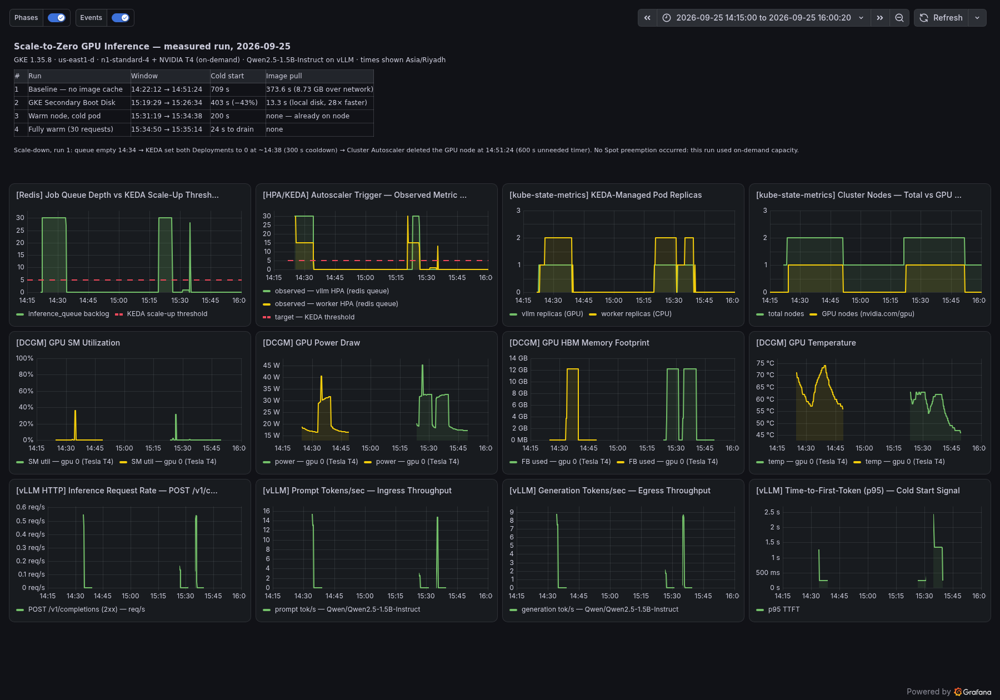
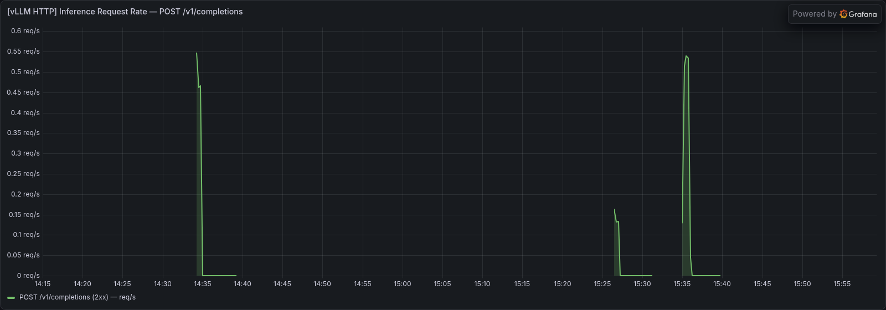
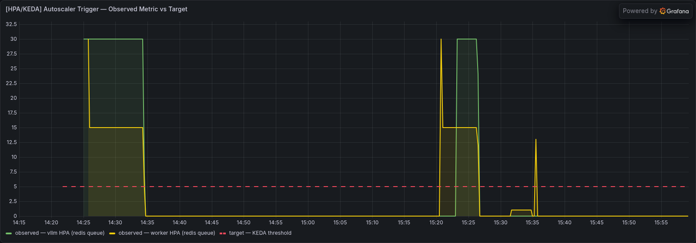
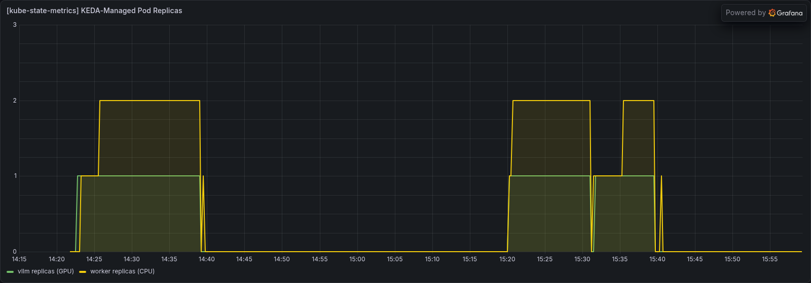
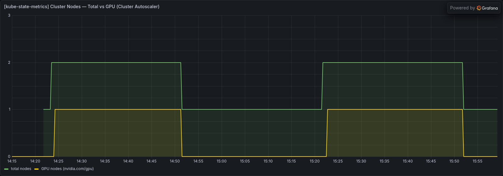

# Scale-to-Zero GPU Inference on GKE — a measured reproduction

Running an LLM on Kubernetes so that it costs **$0/hour when nobody is using it**,
and measuring honestly what that costs you in latency when somebody finally does.

Reproduction and extension of
[adityonugrohoid/gpu-autoscale-inference](https://github.com/adityonugrohoid/gpu-autoscale-inference),
run end-to-end on **GKE 1.35.8 / us-east1-d / NVIDIA T4** on 2026-09-25.
Every number here came out of this run. Nothing is copied from the upstream README.



---

## TL;DR

| | Cold start | Image pull |
|---|---|---|
| Baseline (image pulled over the network) | **709 s** | 373.6 s |
| With GKE Secondary Boot Disk | **403 s** (−43%) | **13.3 s** (28× faster) |
| Warm node, cold pod | 200 s | 0.64 s |
| Fully warm, 30 requests | **24 s** to drain | — |

The optimization works, and it moves the bottleneck rather than removing it.
After the fix, **vLLM's own startup is 48% of what remains** — image pull is no
longer the thing to attack.

Cost of the whole exercise, including one wrong turn: **~$2.10**.

**Deeper reading:** [`docs/RESULTS.md`](docs/RESULTS.md) has every timeline,
phase breakdown and raw-data index. [`docs/FINDINGS.md`](docs/FINDINGS.md) has
the seven failures with full error text and root causes.

---

## Why this problem exists

A GPU costs the same whether it is working or idle — you are billed for the
hour the machine exists, not for what it computed. An LLM endpoint with no
traffic at 3am burns money for nothing.

You cannot fix that with standard Kubernetes autoscaling:

- **HPA watches CPU.** An idle vLLM pod uses 1–2% CPU because the GPU does the
  work. HPA concludes everything is fine and never scales down.
- **HPA cannot reach zero.** One replica is its floor, architecturally.
- **Startup is slow.** An 8.7 GB container plus a model into VRAM is minutes,
  not seconds, so "just create it on demand" is not free.

## How the two autoscalers solve it

```
request → gateway → Redis list → returns job_id immediately (never blocks)
                         │
                    KEDA watches list length
                         │  scales Deployments 0→N
                    vLLM pod requests nvidia.com/gpu: 1
                         │  no node has a GPU → pod is Pending
                    Cluster Autoscaler sees Pending → creates a GPU VM
                         │
                    worker BRPOPs → vLLM → result into Redis (TTL 300s)
                         │
                    queue empties → KEDA → 0 → CA deletes the node → $0/hr
```

The two controllers **never talk to each other**. KEDA knows nothing about GPU
nodes; Cluster Autoscaler knows nothing about Redis. The only thing joining
them is a pod stuck in `Pending`. That indirection is the design, and it is
what makes the system self-healing — a lost node produces a Pending pod again,
and both controllers simply do their normal job a second time.

Captured from the live cluster:

```
KEDAScaleTargetActivated    vllm-autoscaler    Scaled Deployment llm-gateway/vllm
                                               from 0 to 1, triggered by s0-redis-inference_queue
TriggeredScaleUp            vllm-...-65lct     Pod triggered scale-up:
                                               [{...gpu-pool 0->1 (max: 1)}]
```

Note what the Cluster Autoscaler event does *not* mention: Redis, KEDA, or a
queue. It only ever saw an unschedulable pod.

---

## Results

### The four scenarios

| # | Scenario | Time | What was cold |
|---|---|---|---|
| 1 | Cold baseline | **709 s** | node, image, pod |
| 2 | Cold, with boot-disk cache | **403 s** | node and pod; image was local |
| 3 | Warm node, cold pod | **200 s** | only the vLLM process |
| 4 | Fully warm (30 requests) | **24 s** | nothing |

### Where the 709 seconds went, and what changed

| Phase | Run 1 | Run 2 | Δ |
|---|---|---|---|
| KEDA activation | ~12 s | ~12 s | — |
| Cluster Autoscaler provisions the node | 65 s | 130 s | +65 s *(GCE variance, not us)* |
| Node ready → driver → device plugin → scheduled | ~44 s | ~44 s | — |
| **Container image pull (8.73 GB)** | **373.6 s** | **13.3 s** | **−360 s** |
| vLLM boot → readiness probe passes | 213 s | 195 s | −18 s |
| **Total** | **709 s** | **403 s** | **−306 s (−43%)** |

Run 2's node happened to take 65 s longer to appear — pure GCE scheduling
variance. Adjust for it and run 2 lands at ~338 s, which is the number the
upstream author measured on different hardware in a different project on a
different date. Two independent runs, same result.

### The image pull, three ways

| Source | Time for 8.73 GB | Speedup |
|---|---|---|
| Docker Hub over the network | 373.6 s | 1× |
| GKE Secondary Boot Disk (local pd-SSD) | 13.3 s | **28×** |
| Same node's containerd store (pod restart) | 0.64 s | **583×** |

### Why the pull was slow, and why that matters

373.6 s for 8.73 GB is ~23 MB/s. The `n1-standard-4` NIC does multi-Gbps, so
this was never bandwidth. containerd pulls **3 layers concurrently** and has to
decompress each one — CPU-bound on a 4-vCPU node. GKE exposes no knob for it.
You can see the setting in the builder VM's own containerd config dump:

```
MaxConcurrentDownloads:3
```

That diagnosis is the whole reason the fix is "don't pull" rather than "pull faster".

### The bottleneck moved

```
Run 1:   image pull  373 s  = 53% of cold start   ← biggest
Run 2:   vLLM boot   195 s  = 48% of cold start   ← now biggest
```

Of that 195 s, only **28 s** is the model going from PVC into VRAM. The rest is
`import torch`, CUDA context creation, KV-cache profiling and JIT warmup.
Scenario 3 confirms it independently: with node, image and GPU all present, a
fresh vLLM pod still took **200 s** to answer.

So the next lever is not another caching trick. It is either accepting ~400 s,
or keeping vLLM warm — which is exactly the thing scale-to-zero exists to avoid.
**This is where the architecture reaches its honest limit.**

---

## What the dashboard shows

| | |
|---|---|
|  | Three bursts of 30 jobs. The dashed line is the KEDA trigger. |
|  | vLLM 0→1, worker 0→2, then both back to 0 on their own. |
|  | Total nodes 1→2, GPU nodes 0→1→0. This is the scale-to-zero proof. |
|  | T4 SM utilization — flat zero except when work exists. |

All 12 panels are in [`artifacts/screenshots/`](artifacts/screenshots/), and
the raw Prometheus series behind every one of them is in
[`artifacts/data/`](artifacts/data/) as CSV, so the graphs can be checked
rather than trusted.

### GPU telemetry worth reading

- **Power**: idles ~15 W, peaks ~45 W under generation. A T4's 70 W board
  budget is never approached by a 1.5B model.
- **HBM**: jumps to ~12 GB the instant vLLM starts, and stays there. That is
  `--gpu-memory-utilization 0.8` reserving the KV-cache pool up front, not
  gradual demand.
- **Temperature**: 45 °C → 75 °C and back. The decay curve after the queue
  drains is the clearest visual signal that the GPU really is idle.

From vLLM's own boot log:

```
Model loading took 2.98 GiB memory and 27.65 seconds
Available KV cache memory: 8.28 GiB
GPU KV cache size: 310,016 tokens
Maximum concurrency for 4,096 tokens per request: 75.69x
```

75× concurrency on one T4 is PagedAttention's payoff stated as a number.

---

## What broke — seven real failures

None of these are in any README. Every one cost real time.

**1. Teardown orphaned a Persistent Disk.** The script deletes PVCs before the
cluster so the CSI driver can clean up the backing disk — but PD deletion is
async, and the cluster teardown took the CSI controller down first. A 10 GB
pd-balanced disk survived, at ~$0.40/month. Nobody notices $0.40; run this
twenty times and you have a line item nobody can explain. The audit step caught
it on its first real run. Correct ordering is necessary, not sufficient.

**2. `--release-channel None` is no longer allowed.**
```
ERROR: not enrolling clusters in a release channel is now only allowed
for existing customers.
```
The upstream script pins no release channel so a POC cluster never
auto-upgrades mid-demo. Google has since closed that option to new customers.
Fix: `--release-channel regular`.

**3. macOS ships bash 3.2, and `set -u` hates empty arrays.**
```
./03-create-cluster.sh: line 49: SBD_FLAGS[@]: unbound variable
```
Expanding an empty array under `set -u` is an error in bash 3.2 (2007) and
fine in bash 4+. The script would have worked on any Linux box. Fix: use a
plain string and let word-splitting handle it, the way the `--spot` flag
already did.

**4. `roles/editor` cannot install KEDA on GKE.**
```
clusterroles.rbac.authorization.k8s.io "keda-operator" is forbidden:
requires container.clusterRoles.update
```
GKE deliberately withholds RBAC write from Editor — otherwise any Editor could
mint themselves a cluster-admin ClusterRole and project IAM would be
decorative. KEDA's chart creates 4 ClusterRoles and 5 ClusterRoleBindings, so
it simply cannot install. The usual `cluster-admin` bootstrap binding needs the
same permission you lack. You need `roles/container.admin`, and you cannot
grant it to yourself. **This decided which project the POC ran in.**

**5. `grafana:latest` stopped starting.**
```
✗ failed to start rendering service: Using the default [rendering]renderer_token
  is not allowed for production settings
```
The manifest pairs Grafana with the image-renderer sidecar but never sets
`GF_RENDERING_RENDERER_TOKEN`. Older Grafana warned; current Grafana refuses to
boot. The manifest did not change — the `:latest` tag underneath it did.

**6. `gke-disk-image-builder` is pinned to an archived Debian.**
```
Err: .../containerd_1.4.13~ds1-1~deb11u6_amd64.deb  404  Not Found
Failed to start containerd.service: Unit containerd.service not found.
sudo: ctr: command not found
```
Google's own tool hardcodes `debian-11-bullseye-v20230912` as the builder VM
image (`imager.go`, two places). Debian 11 is archived; the containerd package
its apt index points at has been rotated out of the security pool. The build
dies after 21 seconds with only `startup-script-url exit status 1` in the Daisy
output — the real error is in the VM's serial-port log in the GCS bucket. Fix:
point it at `debian-12-bookworm-v20260921`.

**7. The PVC's storage class is not a crash, but it is a slowdown.**
Upstream asks for `storageClassName: standard` — legacy in-tree provisioner,
pd-standard, spinning disk. The cluster default `standard-rwo` is CSI and
pd-balanced SSD. The model loads from that disk into VRAM on every cold start.
Upstream reported ~2.5 min for that step; on pd-balanced it took **28 s**.

### Two more things worth knowing

- **GKE now ships its own DCGM exporter.** `gke-managed-system/dcgm-exporter`
  runs alongside the repo's `llm-gateway/dcgm-exporter`, scraping the same GPU
  twice. Harmless, redundant, and not in any doc the repo links.
- **The boot-disk cache only covers images you put in it.** `dcgm-exporter`
  was not cached and still took **1 m 9 s** to pull its 819 MB. In production,
  every node-critical image belongs in the disk image, not just the big one.

---

## Reproducing it

```bash
cd scripts
./01-preflight.sh        # read-only: tools, IAM, APIs, quota, GPU-in-zone. Free.
./10-fetch-repo.sh       # clone upstream (we use its k8s/ and monitoring/)
./02-build-images.sh     # gateway + worker as linux/amd64 → Artifact Registry
./03-create-cluster.sh   # GKE + CPU pool + GPU pool at 0 nodes + KEDA   ← billing starts
./04-deploy-app.sh       # manifests, PVC, model download, monitoring
./05-smoke-test.sh       # 30 requests; watch both autoscaler layers live
./90-cost-check.sh       # what is running and what it burns, any time
./99-destroy.sh          # teardown + orphan audit
```

Phase 3, only after you have a baseline to compare against:

```bash
./07a-mirror-vllm.sh        # mirror vLLM into AR via Cloud Build (not your laptop)
./07-build-node-cache.sh    # build the secondary boot disk image
# then set VLLM_DISK_IMAGE, recreate the GPU pool, re-run 05
```

Capture before you destroy:

```bash
./08-capture-grafana.sh          # panels as PNG + Prometheus series as CSV
./10-capture-cluster-evidence.sh # events, logs, manifests, GCP facts
```

All configuration lives in `scripts/00-config.sh`. Nothing else needs editing.

### Notes for anyone on a Mac

- Your laptop is arm64; GKE nodes are amd64. `02` uses
  `docker buildx --platform linux/amd64`. A plain `docker build` gives you pods
  crash-looping on `exec format error`, which never mentions architecture.
- `07a` mirrors the 8.7 GB vLLM image with Cloud Build, inside Google's
  network. Doing it locally means 8.7 GB down and 8.7 GB up on home broadband.
  Cloud Build took **4 m 3 s**.

---

## Cost

`us-east1`, on-demand T4 (this project had `PREEMPTIBLE_CPUS = 0`, so Spot was
not available):

| State | Rate |
|---|---|
| Cluster idle, GPU at zero | ~$0.26/hr |
| GPU node up | ~$0.78/hr |
| A ~30 min full cycle | ~$0.35 |

`GPU_POOL_MAX_NODES=1` is a hard ceiling; a runaway load test cannot provision
a second GPU.

**Whole session, including a wasted cluster in the wrong project: ~$2.10.**

---

## What I would change before production

1. **Jobs are lost on worker death.** `BRPOP` removes the item from the list.
   If the worker dies mid-inference — preemption, scale-down, OOM — that job
   exists nowhere, and the client polls `pending` forever. Needs `BRPOPLPUSH`
   into a processing list with a reaper, or Redis Streams with `XACK`.

2. **Redis is a single pod with no persistence.** No AOF, no RDB, no PVC. It
   holds the queue, the results, *and* the metric KEDA scales on. Losing it
   loses all three at once. Memorystore, or at minimum AOF on a PVC.

3. **The gateway is public and unauthenticated.** A LoadBalancer IP with no API
   key and no rate limit on `/generate`. In a scale-to-zero design this is a
   **billing** attack more than an availability one: the attacker's goal is to
   make you provision GPUs.

4. **No end-to-end latency metric.** The dashboard has queue depth, GPU
   utilization and vLLM's TTFT — but TTFT measures inference only, not the
   queue wait in front of it. The number a user actually feels,
   enqueue-to-result, is not instrumented.

5. **`listLength: 5` is a per-replica target, not a threshold.** Desired
   replicas = `ceil(queue_length / 5)`, capped by `maxReplicaCount`. Separately,
   `activationListLength` defaults to `0`, so KEDA wakes on the *first* queued
   item, not the sixth. Observed live: 30 jobs → worker went to its cap of 2.

---

## Repository layout

```
.
├── README.md
├── docs/
│   ├── FINDINGS.md          the seven failures, with root causes
│   └── RESULTS.md           every measurement and how it was taken
├── scripts/                 the tested, fixed scripts (00–99)
└── artifacts/
    ├── screenshots/         17 PNGs — full dashboard + every panel
    ├── data/                15 CSVs of raw Prometheus series + dashboard JSON
    └── evidence/            45 files: k8s events, pod logs, manifests, GCP state
```

## Credit

The architecture, the manifests and the cold-start research are
[Adityo Nugroho](https://github.com/adityonugrohoid)'s
([gpu-autoscale-inference](https://github.com/adityonugrohoid/gpu-autoscale-inference), MIT).
This repository is an independent reproduction on different hardware in a
different project, plus the fixes needed to make it run in September 2026 and
the measurements that came out of it.
